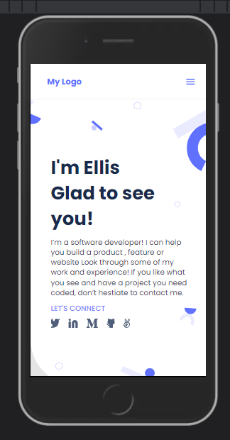
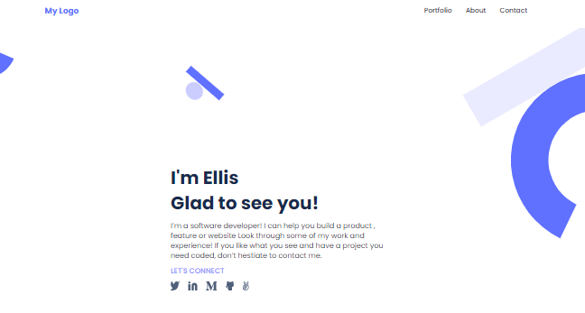

# Portfolio portfolio

The project is inspired by the figma microverse template 1 (https://figma.com/)
For this portfolio website, I implemented Html And Css that includes the project details in mobile.

 

## Live Demo

[Live Demo Link](https://mwanawabangona.github.io/mobile-version-2/)
 
## Built With the following

- HTML
- CSS
- HTML&CSS Linter

## Get Started

Please get your browser update.
To get a local copy up and running follow these simple steps.

Run the command below from the Terminal:

      git clone <URL> 'https://github.com/mwanawabangona/mobile-version-2' in your terminal

	  cd desktop_branch

## Authors

👤 **Ellis**

- Location: Zambia
- GitHub: [@mwnanawabangona](https://github.com/mwanawabangona)
- Twitter: [@Ellis_aah](https://twitter.com/Ellis-aah)
- LinkedIn: [LinkedIn](https://www.linkedin.com/)

👤 **Farouk**

- Location: Egypt
- GitHub: [@farouqdaif1](https://github.com/farouqdaif1)
- Twitter: [@Farouqdaif](https://twitter.com/farouqdaif)
- LinkedIn: [LinkedIn](https://www.linkedin.com/in/farouqdaif/)

👤 **Milan**

- Location: Serbia
- GitHub: [@mprotic123](https://github.com/mprotic123)
- Twitter: [@Milan](https://twitter.com/Ellis-aah)
- LinkedIn: [LinkedIn](https://www.linkedin.com/)

## Authors

👤 **Eloi Ntazama**

- Location: Burundi
- GitHub: [@ntazelo](https://github.com/ntazelo)
- Twitter: [@NtazamaE](https://twitter.com/NtazamaE)
- LinkedIn: [LinkedIn](https://www.linkedin.com/in/eloi-ntazama-a14219214/)

## 🤝 Contributing

Contributions, issues, and feature requests are welcome!

Feel free to check the [issues page](https://github.com/mwanawabangona/mobile-version-2/issues).

## Show your support

Give a ⭐️ if you like this project!

## Acknowledgments

- Thanks to Microverse and my Coding Partners

## 📝 License

This project is [MIT](./MIT.md) licensed.
